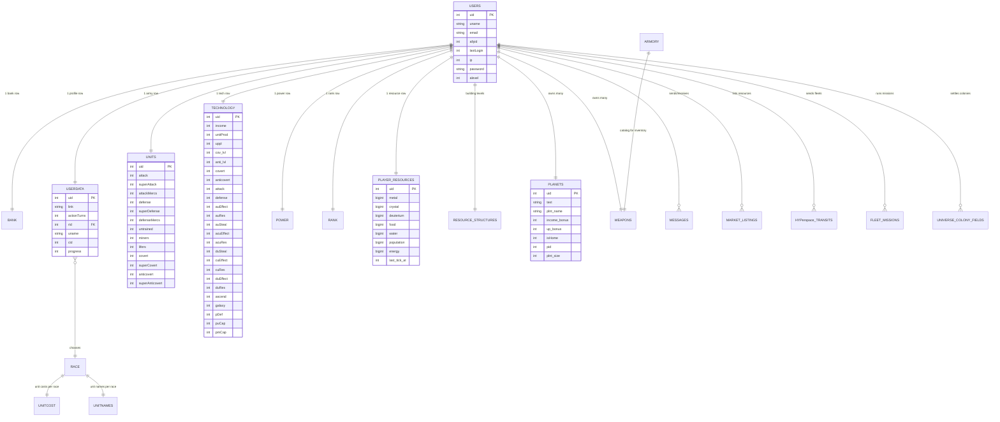

# Database Design

> Schema, entity-relationship view, table reference, and migration strategy for
> Universe Civilization: Empire at Wars.

## 1. Overview

Data lives in one MySQL database (`sgw` by default). Three groups of tables exist:

1. **Legacy core schema** — imported from `game.sql` (players, economy, military).
2. **Backend operational schema** — `database/sql/03_backend_tables.sql`
   (migrations, settings, audit, jobs, daily metrics).
3. **Runtime / feature schema** — created on demand by PHP via
   `CREATE TABLE IF NOT EXISTS` statements (strategic resources, fleets,
   hyperspace, governance, universe events, stores, etc.).

The runtime schema is the reason `config.php` bootstrap and many modules call
`CREATE TABLE IF NOT EXISTS` / `ADD COLUMN IF NOT EXISTS` on each request:
new features deploy themselves without a manual migration.

## 2. Entity-Relationship View



## 3. Table Reference

### 3.1 Legacy core tables (`game.sql`)

| Table | Purpose | Key columns |
|-------|---------|-------------|
| `users` | Account records (auth, IP, alliance, last login) | `uid PK`, `uname`, `email`, `allyid`, `lastLogin`, `ip`, `password`, `alevel` |
| `userdata` | Per-player profile + turns | `uid PK`, `link`, `actionTurns`, `rid`, `uname`, `cid`, `progress` |
| `bank` | Naquadah on hand vs. banked | `uid PK`, `inbank`, `onHand` |
| `units` | Army composition | `uid PK`, attack, superAttack, attackMercs, defense, superDefense, defenseMercs, untrained, miners, lifers, covert, superCovert, anticovert, superAnticovert |
| `technology` | Tech levels and effects | `uid PK`, income, unitProd, uppl, covert/anticovert, attack, defense, au/du/cu effects+resistance+steal, ascend, galaxy, pDef, puCap, pmCap |
| `power` | Computed power snapshot | `uid UK`, overall, mil_atk, mil_def, mil_cov, mil_anti, mil_total |
| `rank` | Computed rank positions | `uid UK`, overall, mil_atk, mil_def, mil_cov, mil_anti, mil_total |
| `race` | Playable + NPC races | `rid PK`, r_name, income_bonus, up_bonus, r_group |
| `planets` | Owned planets | `uid PK`, text, plnt_name, income_bonus, up_bonus, isHome, pid, plnt_size |
| `planetsize` | Planet size labels | `text`, `size` |
| `armory` | Weapon catalog | `wid PK`, rid, isDefense, cash_cost, unit_cost, weaponName, weaponPower, requireTrained |
| `weapons` | Player-owned weapon inventory | `uid PK`, wid, strength, quanity |
| `unitcost` | Unit costs per race | `rid PK`, attack, superAttack, defense, superDefense, covert, superCovert, anticovert, superAnticovert |
| `unitnames` | Unit display names per race | `rid PK`, attack, superAttack, attackMercs, defense, superDefense, defenseMercs, covert, superCovert, anticovert, superAnticovert |
| `messages` | Player inbox/sent | `mid PK`, fromUID, toUID, subject, message, timeSent, isRead, isDeleted, replyToMid |

### 3.2 Backend operational tables (`database/sql/03_backend_tables.sql`)

| Table | Purpose |
|-------|---------|
| `app_migrations` | Applied migration keys |
| `app_settings` | Key/value server settings |
| `app_audit_log` | Audit trail (uid, action_type, module_name, details_json, ip) |
| `app_server_jobs` | Long-running job tracking |
| `app_daily_economy_metrics` | Daily economy snapshots for reporting |

### 3.3 Runtime / feature tables (created by PHP)

| Table | Created by | Purpose |
|-------|-----------|---------|
| `player_resources` | `Game::ensurePlayerStateTables`, `User::addUser`, `game_tick.php`, `commandergov.php`, `pages.php` | Strategic resources + last tick timestamp |
| `resource_structures` | `game_tick.php`, `ogamebuildings.php` | Metal mine, crystal lab, deuterium refinery, hydroponics, water plant, habitat dome, energy reactor levels |
| `hyperspace_systems` | `game_tick.php`, `hyperspace.php` | Jump gate / stargate / core levels, lane stability |
| `hyperspace_routes` | `hyperspace.php` | Route catalog |
| `hyperspace_transits` | `game_tick.php`, `hyperspace.php` | Fleet transits (enroute → arrived → completed) |
| `fleet` / `fleet_missions` | `fleetdock.php` | Owned ships + mission queue |
| `shipyard` / `shipyard_starship_catalog` | `fleetdock.php` | Shipyard state and ship catalog |
| `military_command_state` / `military_troop_catalog` / `military_troop_queue` | `pages.php` | Military suite state |
| `operations_rts_state` / `operations_turn_queue` | `pages.php` | RTS turn system |
| `ogame_building_levels` | `ogamebuildings.php` | OGame-style building levels |
| `mega_building_catalog` / `mega_owned_assets` / `mega_starship_catalog` / `mega_unit_catalog` | `megaforge.php` | Mega Forge assets |
| `commander_settings` / `governance_system_levels` | `commandergov.php` | Commander governance |
| `stargate_tech_levels` | `stargatetech.php`, `game_tick.php` | Stargate tech levels (feed production bonuses) |
| `market_listings` | `market.php` | Player resource listings |
| `research_infrastructure` | `techlib.php` | Lab network / infrastructure |
| `blueprint_catalog` / `blueprint_hangar` / `player_blueprints` | `pages.php` | Blueprint systems |
| `economy_store_catalog` / `economy_store_purchases` | `pages.php` | In-game store |
| `economy_pass_progress` / `economy_pass_claims` | `pages.php` | Battle pass / season pass |
| `space_installations` | `stations.php` | Station command |
| `universe_colony_fields` / `universe_colony_profiles` | `pages.php` | Colony fields |
| `universe_world_boss` / `universe_world_plagues` / `universe_world_water_sources` | `pages.php` | World boss + world systems |
| `universe_event_log` / `universe_event_state` | `pages.php` | Universe events |
| `universe_seed_bookmarks` | `pages.php` | Universe seeds |
| `universe_story_log` / `universe_story_progress` | `pages.php` | Story campaign |
| `news` | `base.php` | In-game news feed |
| `actionlog` | `Game::ensureActionLogTable` | Combat/action reports |

> The authoritative column list for each runtime table is the `CREATE TABLE IF
> NOT EXISTS` statement in the owning file. Search the codebase for the table
> name to find it.

## 4. Migration Strategy

### 4.1 Formal migrations (`database/sql/`)

```bash
mysql -u root -p < database/sql/01_create_database.sql   # creates db + grants
mysql -u sgw -psgwpass sgw < game.sql                    # core legacy schema
./scripts/backend/db_migrate.sh                          # 03..07 backend layer
```

`db_migrate.sh` executes the numbered SQL bundle in order and records keys in
`app_migrations`.

### 4.2 Inline / self-healing migrations

The application deliberately runs idempotent DDL at runtime:

```sql
CREATE TABLE IF NOT EXISTS player_resources (...);
ALTER TABLE player_resources ADD COLUMN IF NOT EXISTS energy BIGINT NOT NULL DEFAULT 50000;
INSERT IGNORE INTO player_resources (uid) VALUES (1);
```

**Rule for contributors:** when adding a column or table, ship the idempotent
DDL in the owning module *and* (for backend-visible tables) add it to the SQL
bundle so clean installs and live installs converge.

## 5. Reporting Views

`database/sql/04_reporting_views.sql` defines normalized views for the backend:

- `vw_player_core` — identity, rank, alliance.
- `vw_player_economy` — bank, resources, income, production.
- `vw_player_military` — unit totals, power, rank positions.

These feed `tools/backend/export_reports.php` and the daily economy metrics job.
