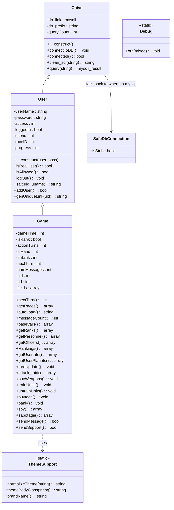
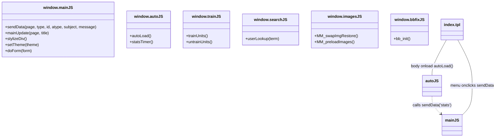
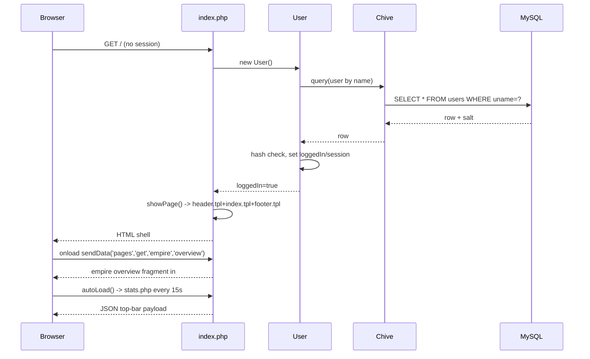
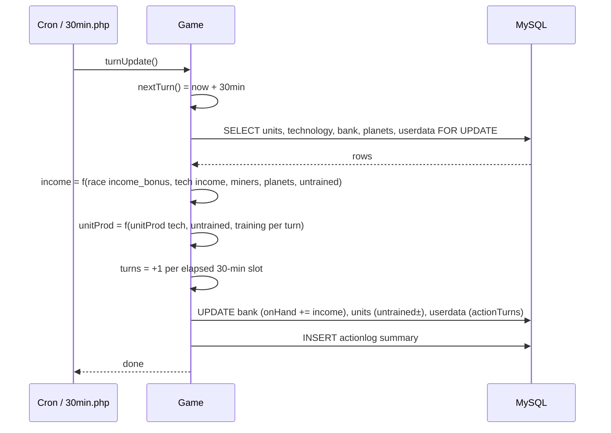

# UML Diagrams

> Class and sequence diagrams for the Universe Civilization: Empire at Wars
> backend and frontend. Rendered with Mermaid (supported by GitHub and
> docs renderers).

## 1. Class Diagram — Domain Layer



## 2. Class Diagram — Frontend



## 3. Sequence Diagram — Login Flow



## 4. Sequence Diagram — AJAX Page Navigation

```mermaid
sequenceDiagram
    participant B as Browser
    participant M as js/main.js
    participant X as modules/<page>.php
    participant G as Game
    participant D as MySQL

    B->>M: click menu item
    M->>X: POST/GET sendData('<module>', type, id, atype)
    X->>X: include config.php; login+time guard
    X->>G: new Game(); call gameplay action
    G->>D: SELECT/UPDATE
    D-->>G: result
    G-->>X: data
    X-->>M: HTML fragment (or text result)
    M->>M: stylizeDiv() inject into #mainDisplay
    M-->>B: render updated region
```

## 5. Sequence Diagram — Turn Tick (`turnUpdate()`)



## 6. Sequence Diagram — Cron Economy Tick (`game_tick.php`)

```mermaid
sequenceDiagram
    participant CR as cron (every 5 min)
    participant T as scripts/backend/game_tick.php
    participant P as player_resources
    participant H as hyperspace_transits
    participant D as MySQL

    CR->>T: php game_tick.php
    T->>T: parse --dry-run / --uid=N
    T->>D: SELECT uid, last_tick_at FROM player_resources
    T->>T: elapsed = now - last_tick_at; slots = floor(elapsed/1800)
    alt slots >= 1
        T->>P: UPDATE metal/crystal/deuterium/food/water/population += rate*slots
        T->>P: UPDATE energy (consumed vs produced)
        T->>P: UPDATE last_tick_at += slots*1800
    end
    T->>H: process enroute -> arrived transits
    T->>D: UPSERT app_server_jobs heartbeat
    T-->>CR: summary line (dry-run => no writes)
```

## 7. Sequence Diagram — Player Attack / Raid

```mermaid
sequenceDiagram
    participant B as Browser
    participant A as modules/attack.php
    participant G as Game
    participant D as MySQL

    B->>A: sendData('attack','get',uid,'attack')
    A->>G: new Game(); attack_raid(target)
    G->>D: SELECT defender units/power, defender resources
    G->>G: attackerPower vs defenderPower; ratios
    G->>G: compute kills both sides, loot (income/steal caps)
    G->>D: UPDATE both unit tables, bank, resources
    G->>D: INSERT actionlog for both players
    G-->>A: battle report
    A-->>B: rendered report fragment
```
